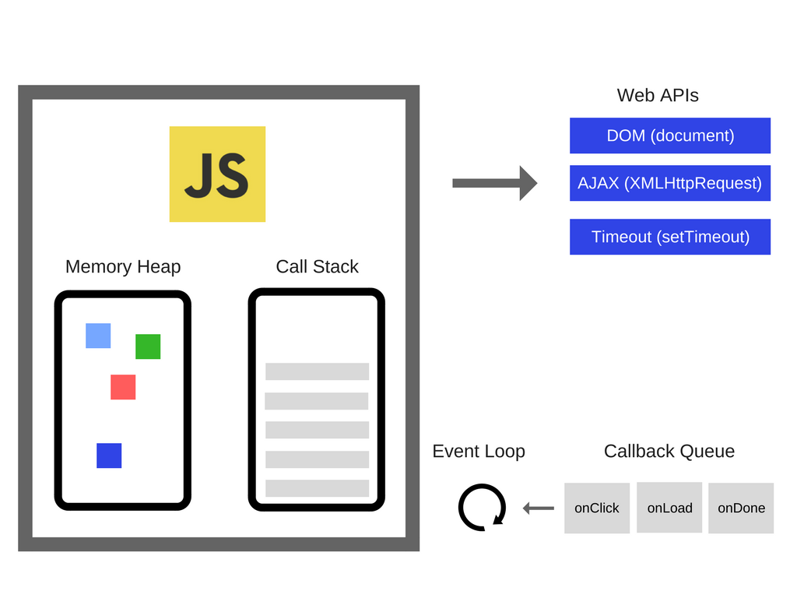

# Intermediate JavaScript

<details>
  <summary>Day One</summary>

## JavaScript History

<details>
<summary>Beginnings</summary>

> Created by engineers at NetScape, a popular browser when the web was at its infancy, in order to make pages dynamic. 

> First approach was to embed either Java or Scheme in web sites.

> Decided to make their own language. Early versions were called LiveScript.

> The name "JavaScript' was likely a way to capitalize on the popularity of Java at the time.

> Early years were volatile, as the "browser wars" were happening.

> Eventually, the European Computer Manufacturers Association (ECMA) finalized a standard spec for web scripting languages - ECMAScript

> By 2009, ECMAScript5 was the clear winner
</details>

<details>
<summary>The rise of front-end frameworks</summary>

> In the 2010s, we started to view the browser as a first-class code execution environment.

> JavaScript frameworks to make this easier came on the scene
> - EmberJS
> - Backbone.js
> - AngularJS
> - ReactJS
> - Vue.js

- Moving from the browser to the server with Node.js
> In 2009, Node.js was release
> - Server-side runtime that permits execution of JavaScript outside of the browser's execution environment
</details>

<details>
  <summary>JS Up to 2015</summary>

> The language evolved slowly until 2015, even as it became VERY popular

> Developers asked for language features to make dev work easier and more in line with popular OOP/server-side languages
</details>

<details>
  <summary>JS After 2015</summary>

> The base spec, ECMAScript, had a _major_ upgrade in 2015
> ECMAScript brought important changes, but they used the underlying JavaScript functionality - so backwards compatibility was preserved to a great extent. Some important additions:
> - Classes
> - Execution context (```.this``` keyword)
> - Reusable code modules
> - Iterators
> - Simpler syntax to declare functions
> - Simpler syntax for async functions
> - Reflection
> - and lots more. Full spec is [here](https://262.ecma-international.org/6.0/)

- Every year since, a new spec has been released, with new features
</details>

## JavaScript/DOM fundamentals review

<details>
  <summary>Primitives</summary>

> Data that is _not_ an Object and has _no methods_. They are _immutable_.

> Full list:
> - string
> - number
> - bigint
> - boolean
> - undefined
> - symbol
> - null
</details>

<details>
  <summary>Objects</summary>

> Data that is a _collection of properties_.

> Using _object literal syntax_, you can initialize a limited set of properties.
>> Example:

```javascript
var student = {
    first_name: 'Jane',
    last_name: 'Doe'
}
```
> Properties can be added or removed after the Object has been initialized.
</details>

<details>
  <summary>Functions</summary>

> Functions are actually _objects_.

> They may or may not have _parameters_.

> They may or may not have a _return_ Object.

> There are two ways to create a function - as a _declaration_ and as an _expression_.
>> Declared functions are called directly

>> Function expressions can be passed to other functions as a parameter

> Example of a function _declaration_:
```javascript
function square(number) {
  return number * number;
}
```

> Example of an anonymous function _expression_
```javascript
var square = function(number) { return number * number }
```

> Example of a named function expression:
```javascript
var square = function sqr (number) { return number * number }
console.log(square(2)); // returns 4
```
</details>

## Tech Setup
<details>
  <summary>VS Code</summary>

> Download [VS Code](https://code.visualstudio.com/download) and install

> Open the provided folder called ```course_materials```

> NOTE: This gives you access to the course materials, including this Markdown file (```outline.md```). You can open it and preview the markdown by right-clicking on the tab and selecting ```Open Preview```

> NOTE: Set auto-save ON (```File/Auto Save```)
</details>

<details>
  <summary>Code Runner</summary>

> Add the ```Code Runner``` extension

> Test the extension by opening the ```foo.js``` file and running this code (use ```CTRL-ALT-N```)
>> Look for the console output in the bottom window in VS Code
</details>

<details>
  <summary>Live Server</summary>

> Add the ```Live Server``` extension

> Test the extension by opening the ```index.html``` file and running the page on Live Server (right-click the file and select ```Open With Live Server```)
>> Look for the page to open in your default browser
</details>

## LAB: Getting Familiar with Code Runner and Live Server

<details>
  <summary>"square" functions</summary>

> Using Code Runner, create and use all three variations of the "square" function from earlier:
> - Function declaration
> - Anonymous function expression
> - Named function expression

> NOTE: Place this code in the ```lab.square.js``` file
</details>

<details>
  <summary>"power" functions</summary>

> Using Code Runner, create and use a function that calculates powers. 
>> The function will take in two integers ("number" and "exponent"). It will return the power expression of the two integers.
>> For example, a call of ```power(10,3)``` will return 1000, as 10 the the third power is 1000

> Create three variations of this "power" function as earlier:
> - Function declaration
> - Anonymous function expression
> - Named function expression

> NOTE: Place this code in the ```lab.power.js``` file
</details>

<details>
  <summary>Putting script in a web page</summary>

> Reference your ```lab.power.js``` file in ```index.html```
>> Verify this works by viewing the Developer Tools console for expected output
</details>

<details>
  <summary>Extra credit</summary>

> Write a function to perform the following:
>> Given an array of integers, determine which integer occurs the most times in the array

> [HINT](https://www.geeksforgeeks.org/frequent-element-array/) (Don't look unless you really have to)
</details>

## Transitioning to modern JS

<details>
  <summary>let and const</summary>

> A new way to do variables: ```let``` and ```const``` keywords

> Mutability is the key here

> Variables made with the ```let``` keyword are mutable

> Those made with the ```const``` keyword are not
</details>

<details>
  <summary>use strict</summary>

> This lets you _opt in_ to a restricted variant of JS

- Eliminates some JavaScript silent errors by changing them to throw errors.
- Fixes mistakes that make it difficult for JavaScript engines to perform optimizations: strict mode code can sometimes be made to run faster than identical code that's not strict mode.
- Prohibits some syntax likely to be defined in future versions of ECMAScript.

> Example: prevents you from using undeclared variables

> Enforces better code
</details>

<details>
  <summary>Arrow functions</summary>

> A compact alternative to declare functions

> Example:

```javascript
// traditional approach:
myFunction = function(param) {
    console.log(param);
}

myFunction("foo");

// arrow function

myFunction = (param) => {
  console.log(param);
}

myFunction("foobar");
```

> How to convert from traditional to arrow function:
>> Remove the ```function``` keyword

>> Place an arrow (```=>```) after the parentheses

> This can be done with anonymous functions as well:

```javascript
// Traditional Anonymous Function
let foo =  function (a) {
    console.log(a + 100);
}

foo(5);

// Arrow function
let bar = (a) => {
    console.log(a + 100);
}

bar(10);
```
</details>

<details>
  <summary>Execution context (this)</summary>

> The keyword ```this``` is used to work with _context_ - that is, it refers to the object upon which a function is invoked

> That means the ```this``` keyword can only be used in a function, or globally

> Simple example of use in a function:

```javascript
const test = {
  prop: 42,
  func: function() {
    return this.prop;
  },
};

console.log(test.func());
// expected output: 42
```
> Here, the ```func``` function is invoked on the ```test``` object, so we can use the ```this``` keyword to refer to the ```test``` object

> Simple example of use at the global level:

```javascript
// this code needs to run in a browser
// recall that in a browser, the window object is the global object
console.log(this === window);

var a = 15;
console.log(this.a);
```

> The keywork ```this``` means different things depending on where it is used. Let's explore some of the more common uses:

> Example: Global property

```javascript
window.music = "classical";

console.log(this.music); //"classical" (global)
```

> Note that it's not good practice to execute at the global context; this just illustrates how ```this``` refers to the window (global) object

> Example: Add a function

```javascript
window.music = 'classical';

var foo = function (){
    var music = 'blues';

    return this.music;
};

console.log(this.music); //'classical' (global)

console.log(foo()); //'classical' (global)
```

> Here, you might expect ```this.music``` to output "blues". Why doesn't it?

> In the function ```foo```, ```music``` is a variable - and ```this``` refers only to _objects_, not variables. So here, ```this``` in ```return this.music``` refers to the _object_ to which the function ```foo``` belongs - the ```window``` object

> Example with nested function:

```javascript
window.music = 'classical';

var foo = function (){
    var music = 'blues';
    return this.music;
},
bar = {
    music : 'jazz',
    getMusic : function(){
        return this.music;
    }
};

console.log(this.music); //'classical' (global)

console.log(foo()); //'classical' (global)

console.log(bar.getMusic()); //'jazz' (property of object: bar)
```

> Why does ```bar.getMusic()``` output "jazz"?

> The reason for that is that when a function is a _method_ of an object, the ```this``` keyword refers to the object upon which that function is invoked.

> Here, ```this``` refers to the _object_ upon which the ```getMusic``` function is called - the ```bar``` object

>Example with a constructor
```javascript
window.music = 'classical';

var foo = function (){
            var music = 'blues';

            return this.music;
      },
      bar = {
            music : 'jazz',
            getMusic : function(){
                        return this.music;
            }
      },
      Baz = function(){
            this.music = 'rock';

            this.getMusic = function(){
                        return this.music;
            };
      },
      bif = new Baz();

console.log(this.music); //'classical' (global)

console.log(foo()); //'classical' (global)

console.log(bar.getMusic()); // 'jazz' (property of object: bar)

console.log(bif.getMusic()); // 'rock' (property of instance object: bif)
```

> Why does ```bif.getMusic()``` output "rock"?

> What would the output be if we simply called ```Baz()```?

</details>

<details>
  <summary>Scope</summary>

> Understanding the difference between _scope_ and _context_ is important
>> _scope_ relates to the visibility of variables

>> _context_ (```this```) relates to object to which a function belongs

> It can help to review how scope worked pre-ES6:

> SCOPING IN JAVASCRIPT IS _LEXICAL_ NOT _BLOCK_ - meaning, a variable declared outside a function MAY BE ACCESSED INSIDE THAT FUNCTION

> The word lexical refers to the fact that lexical scoping uses the location where a variable is declared within the source code to determine where that variable is available

> Let's see how that works with the pre-ES6 ```var``` kayword:

> Consider this code:

```javascript
    var greeter = "hey hi";
    var times = 4;

    if (times > 3) {
        var greeter = "say Hello instead"; 
    }
    
    console.log(greeter) // "say Hello instead"
```

> On line 5, we've changed the value of the variable ```greeter``` - but what if we weren't aware that the code already had a variable named ```greeter```?

> Here comes ```let```

> The big difference: ```let``` is _block scoped_ - meaning anything inside curly brackets is only accessible inside those brackets (the "block")

Example:
```javascript
   let greeting = "say Hi";
   let times = 4;

   if (times > 3) {
        let hello = "say Hello instead";
        console.log(hello);// "say Hello instead"
    }
   console.log(hello) // hello is not defined
```
</details>

<details>
  <summary>Closures</summary>

> Closures are _very_ important for maintaining data privacy in you code

> A closure is the combination of a function bundled together (enclosed) with references to its surrounding state (the lexical environment)

> In other words, a closure gives you access to an outer function’s scope from an inner function

> In JavaScript, closures are created every time a function is created, at function creation time

> How do you use a closure? _Define a function inside another function and expose it_

> How do you expose a function? _Return it or pass it to another function_

> Let's look at an example, starting with another example of lexical scoping:

```javascript
function init() {
  var name = 'FooBar'; // name is a local variable created by init
  function displayName() { // displayName() is the inner function, a closure
    console.log(name); // use variable declared in the parent function
  }
  displayName();
}
init();
```

> Now look at this example, with a closure:

```javascript:
function makeFunc() {
  var name = 'FooBar';
  function displayName() {
    alert(name);
  }
  return displayName;
}

var myFunc = makeFunc();
myFunc();
```

</details>

### LAB: Convert old JS to ES6 syntax

<details>
  <summary>Convert a simple Todo app</summary>

You have a pre-ES6 JS "Todo" app. Here is your code:

<details>
  <summary>HTML</summary>

```html
<div id="myDIV" class="header">
  <h2>My To Do List</h2>
  <input type="text" id="myInput" placeholder="Title...">
  <span onclick="newElement()" class="addBtn">Add</span>
</div>

<ul id="myUL">
  <li>Hit the gym</li>
  <li class="checked">Pay bills</li>
  <li>Meet George</li>
  <li>Buy eggs</li>
  <li>Read a book</li>
  <li>Organize office</li>
</ul>
```
</details>

<details>
  <summary>CSS</summary>

```css
/* Include the padding and border in an element's total width and height */
* {
  box-sizing: border-box;
}

/* Remove margins and padding from the list */
ul {
  margin: 0;
  padding: 0;
}

/* Style the list items */
ul li {
  cursor: pointer;
  position: relative;
  padding: 12px 8px 12px 40px;
  background: #eee;
  font-size: 18px;
  transition: 0.2s;

  /* make the list items unselectable */
  -webkit-user-select: none;
  -moz-user-select: none;
  -ms-user-select: none;
  user-select: none;
}

/* Set all odd list items to a different color (zebra-stripes) */
ul li:nth-child(odd) {
  background: #f9f9f9;
}

/* Darker background-color on hover */
ul li:hover {
  background: #ddd;
}

/* When clicked on, add a background color and strike out text */
ul li.checked {
  background: #888;
  color: #fff;
  text-decoration: line-through;
}

/* Add a "checked" mark when clicked on */
ul li.checked::before {
  content: '';
  position: absolute;
  border-color: #fff;
  border-style: solid;
  border-width: 0 2px 2px 0;
  top: 10px;
  left: 16px;
  transform: rotate(45deg);
  height: 15px;
  width: 7px;
}

/* Style the close button */
.close {
  position: absolute;
  right: 0;
  top: 0;
  padding: 12px 16px 12px 16px;
}

.close:hover {
  background-color: #f44336;
  color: white;
}

/* Style the header */
.header {
  background-color: #f44336;
  padding: 30px 40px;
  color: white;
  text-align: center;
}

/* Clear floats after the header */
.header:after {
  content: "";
  display: table;
  clear: both;
}

/* Style the input */
input {
  margin: 0;
  border: none;
  border-radius: 0;
  width: 75%;
  padding: 10px;
  float: left;
  font-size: 16px;
}

/* Style the "Add" button */
.addBtn {
  padding: 10px;
  width: 25%;
  background: #d9d9d9;
  color: #555;
  float: left;
  text-align: center;
  font-size: 16px;
  cursor: pointer;
  transition: 0.3s;
  border-radius: 0;
}

.addBtn:hover {
  background-color: #bbb;
}
```

</details>

<details>
  <summary>JavaScript</summary>

```javascript
// Create a "close" button and append it to each list item
var myNodelist = document.getElementsByTagName("LI");
var i;
for (i = 0; i < myNodelist.length; i++) {
  var span = document.createElement("SPAN");
  var txt = document.createTextNode("\u00D7");
  span.className = "close";
  span.appendChild(txt);
  myNodelist[i].appendChild(span);
}

// Click on a close button to hide the current list item
var close = document.getElementsByClassName("close");
var i;
for (i = 0; i < close.length; i++) {
  close[i].onclick = function() {
    var div = this.parentElement;
    div.style.display = "none";
  }
}

// Add a "checked" symbol when clicking on a list item
var list = document.querySelector('ul');
list.addEventListener('click', function(ev) {
  if (ev.target.tagName === 'LI') {
    ev.target.classList.toggle('checked');
  }
}, false);

// Create a new list item when clicking on the "Add" button
function newElement() {
  var li = document.createElement("li");
  var inputValue = document.getElementById("myInput").value;
  var t = document.createTextNode(inputValue);
  li.appendChild(t);
  if (inputValue === '') {
    alert("You must write something!");
  } else {
    document.getElementById("myUL").appendChild(li);
  }
  document.getElementById("myInput").value = "";

  var span = document.createElement("SPAN");
  var txt = document.createTextNode("\u00D7");
  span.className = "close";
  span.appendChild(txt);
  li.appendChild(span);

  for (i = 0; i < close.length; i++) {
    close[i].onclick = function() {
      var div = this.parentElement;
      div.style.display = "none";
    }
  }
}
```

</details>

> YOUR TASK: 
- Get the app working. You will need to flesh out the HTML and connect the CSS and JS files
- Rewrite the JS to use ES6 syntax. Pay attention to the use of the ```let``` and ```const``` keywords, as well as arrow functions

> Create your app in a new folder in your project. Call the folder ```todo```

</details>

### LAB
- Execution context (this)
- YOUR TASK: Write a simple program to demonstrate use of the ```this``` keyword to a new JS learner
  - Be sure to provide comments that a new learner can use to follow what's happening in the code

### LAB
- Closures
- YOUR TASK: Write a simple program to demonstrate use of the ```this``` keyword to a new JS learner
 - Be sure to provide comments that a new learner can use to follow what's happening in the code

## Functional programming

<details>
  <summary>Higher-order functions</summary>

> Remember that functions are just another type of data in JS

> You can assign a function as the value of a variable

Example:

```javascript
let plusFive = (number) => {
  return number + 5;  
};
// f is assigned the value of plusFive
let f = plusFive;
 
plusFive(3); // 8
// Since f has a function value, it can be invoked. 
f(9); // 14
```

> Functions are different from other data types because they can be _invoked_

> We can also pass a function to another function as an arguement. When we do that, we need special names for the functions involved:

>> The function we are passing in is called a "callback" function

>> The function receiving the callback function is called the "higher-order" function. This is because, in relation to the callback function, the receiving function is "higher" the context of the execution environment

>> Another way of thinking of this is that higher-order functions are functions that perform operations on _other functions_

Example:

```javascript
const isEven = (n) => {
  return n % 2 == 0;
}
 
let printMsg = (evenFunc, num) => {
  const isNumEven = evenFunc(num);
  console.log(`The number ${num} is an even number: ${isNumEven}.`)
}
 
// Pass in isEven as the callback function
printMsg(isEven, 4); 
// Prints: The number 4 is an even number: True.
```


</details>

## LAB: Writing higher-order functions

<details>
  <summary>Using forEach()</summary>

> You have this function:

```javascript
const numbers = [1, 2, 3, 4, 5];

function addOne(array) {
  for (let i = 0; i < array.length; i++) {
    console.log(array[i] + 1);
  }
}

addOne(numbers);
```

> Look up the higher-order function ```forEach()``` and refactor the ```addOne``` function to make use of it
</details>

<details>
  <summary>Using filter()</summary>

1. Create a function which taked in two parameters: an array of integers, and an empty array. Put all even numbers from the first array into the second array. Your code should do this using a loop.
2. Refactor the function to use the higher-order function ```filter()```

</details>

<details>
  <summary>Creating your own higher-order functions

> Say you have this function:

```javascript
function calculate(numbers) {
  let sum = 0;
  for (const number of numbers) {
    sum = sum + number;
  }
  return sum;
}
calculate([1, 2, 4]); // => 7
```

> Your task is to make the ```calculate()``` function a higher-order function that will take in three parameters. 

> The first, ```operation```, will be a callback function that performs the desired math operation (sum and multiply are needed). 

> The second parameter will be the initial value you start your operation with. 

> The third will be an array of numbers that the operation will work with.

Example signature of the new ```calculate()``` method:

```javascript
function calculate(operation, initialValue, numbers) {
  // implmentation
}
```
</details>


## The DOM and Browser APIs

<details>
  <summary>setTimeout() and setInterval()</summary>

> Browsers now implement a "Web API" that your code can call on for operations outside the single thread of your application

>One of the functions available throught the Web API is ```setTimeout()```; another is ```setInterval()```

> ```setTimeout()``` makes the code wait a specified amount of time before executing a passed-in callback function

Example:

```javascript
function task() {
    console.log('setTimeout Demo!')
}

setTimeout(task, 3000);
```

Another, more complex example:

HTML:
```html
<p>JavaScript setTimeout Demo</p>
<button onclick="showAlert();">Show</button>
<button onclick="cancelAlert();">Cancel</button>
```

JS:
```javascript
var timeoutID;

function showAlert() {
    timeoutID = setTimeout(alert, 3000, 'setTimeout Demo!');
}

function clearAlert() {
    clearTimeout(timeoutID);
}
```

> ```setInterval()``` function in the Web API will perform a callback function repeatedly at a specified interval

Example:

```javascript
setInterval(function(){ alert("Hello"); }, 3000);
```

</details>

<details>
  <summary>LocalStorage</summary>

> While the browser environment is not suited to provide persistent storage for your application, there are ways to store data temporarily

> For years, we used cookies for this purpose, but they are not very versatile, and are not suited for large amounts of data

> One of these additional options is "Local Storage". It is a collection of key/value string pairs. 

> JS allows us to access Local Storage with another built-in Web API: the Web Storage API

> Local Storage is available on a "per-origin" basis - that is, all pages from a single origin can access the stored data

> While the Web Storage API actually provides two ojects for our use, we will be exploring only one: the ```window.localStorage``` object, which stores data with no expiration data
>> THe other, ```window.sessionStorage```, only allows data storage for the length of a session

Setting and retrieving data from Local Storage is pretty simple:

```javascript
// Store
localStorage.setItem("lastname", "Gross");

// Retrieve
document.getElementById("result").innerHTML = localStorage.getItem("lastname");
```

There is an alternate get/set syntax, arguably cleaner:

```javascript
// Store
localStorage.lastname = "Smith";
// Retrieve
document.getElementById("result").innerHTML = localStorage.lastname;
```

> Using the data in Local Storage
>> Remember, the values in Local Storage are stored as _strings_ - if they represent other data types, you'll need to convert them for use

Example:

```javascript
if (localStorage.clickcount) {
  localStorage.clickcount = Number(localStorage.clickcount) + 1;
} else {
  localStorage.clickcount = 1;
}
document.getElementById("result").innerHTML = "You have clicked the button " +
localStorage.clickcount + " time(s).";
```

</details>

<details>
  <summary>Web Workers</summary>

> JavaScript is executed in a single thread in the browser. What do you do if you want to run a background process?

> Browsers implement another Web API, the Web Workers API, for this purpose

> Using a built-in ```Worker``` object, which can be instantiated, you can run JS in the background of your app

Example of a background process:

```javascript
var i = 0;

function timedCount() {
  i = i + 1;
  postMessage(i);
  setTimeout("timedCount()",500);
}

timedCount();
```

Example of calling that process with a Web Worker:

```html
<!DOCTYPE html>
<html>
<body>

<p>Increment numbers: <output id="result"></output></p>
<button onclick="startWorker()">Start Worker</button> 
<button onclick="stopWorker()">Stop Worker</button>

<script>
var w;

function startWorker() {
  if(typeof(Worker) !== "undefined") {
    if(typeof(w) == "undefined") {
      w = new Worker("demo_workers.js");
    }
    w.onmessage = function(event) {
      document.getElementById("result").innerHTML = event.data;
    };
  } else {
    document.getElementById("result").innerHTML = "Sorry, your browser does not support Web Workers...";
  }
}

function stopWorker() { 
  w.terminate();
  w = undefined;
}
</script>

</body>
</html>
```

</details>

### LAB: Using Local Storage

<details>
  <summary>Using Local Storage</summary>

> Your task: Refactor the Todo app to store todo items in local storage
>> Your app will need to build an HTML unordered list using the key/value pairs stored in Local Storage
>> Try to use ES6 syntax where possible

</details>

## Forms in the browser

<details>
  <summary>FormData and forms, vs. AJAX</summary>

> With HTML forms and their input fields is very common

> JavaScript in the browser has a built-in object we can use to make this easier: the ```FormData``` object:

```javascript
let formData = new FormData([form]);
```

> If the ```form``` parameter is included, and it's a ```<form>``` element on your page, the key/value pairs from your form will be automatically added to the newly-instatiated ```FormData``` object (```formData``` here)

Example:

```javascript
<form id="formElem">
  <input type="text" name="name" value="John">
  <input type="text" name="surname" value="Smith">
  <input type="submit">
</form>

<script>
  formElem.onsubmit = async (e) => {
    e.preventDefault();

    let response = await fetch('/article/formdata/post/user', {
      method: 'POST',
      body: new FormData(formElem)
    });

    let result = await response.json();

    alert(result.message);
  };
</script>
```

Let's look at this with a working code example:

```html
<!doctype html>

<html lang="en">
<head>
  <meta charset="utf-8">
  
  <title>A Basic HTML5 Template</title>
  
</head>

<body>
  <h3>Blog Posts</h3>
  <form id="formElem">
    <input type="text" name="title" value="My trip to Kansas">
    <input type="text" name="body" value="That's a lot of corn, by golly!">
    <input type="text" name="userId" value="1">
    <input type="submit">
  </form>
  
  <script>
    formElem.onsubmit = async (e) => {
      e.preventDefault();
  
      let response = await fetch('https://jsonplaceholder.typicode.com/posts', {
        method: 'POST',
        body: new FormData(formElem)
      });
  
      let result = await response.json();
  
      alert(result.id);
    };
  </script>
  ```
  
</body>
</html>
```


</details>

- Input validation
- Local file access and file input

### DEMO
- Form creation, validation and submission

### LAB
- Form creation, validation and submission

</details>

<details>
  <summary>Day Two</summary>

## Asynchronous Programming

### LECTURE
- JS Runtime
- Promises
- Async/Await keywords
- AJAX calls with Axios library

<details>
  <summary>The JavaScript Runtime Environment</summary>

> The runtime environment is what makes JavaScript code work, and in a browser in consists of the JS engine, a lot of Web APIs, a callback queue and the event loop

> The JS engine translates source code into machine code that allows a computer to perform specific tasks at the hardware level

> Web APIs extend the JS language and push callback functions to the callback queue once actions are complete and data has been received

> The callback queue stores callback functions in order, ready to be executed

> The event loop is constantly monitoring the call stack and the callback queue; if the call stack is empty it will move the callback function at the front of the queue to the call stack, scheduling it for execution
</details>

<details>
  <summary>Diagram of Event Loop</summary>



</details>

<details>
  <summary>Promises</summary>

> JavaScript is single-threaded

> Async calls are needed for complex web apps in the browser

> ES6 introduced Promises, a clear syntax for async functions - "I, _function_, promise to return..."

> A Promise is an object that may produce a value in the future:
>> either a resolved value, or 
>> the reason it can't resolve (network error, etc.)

<details>
  <summary>Promises have one of three states:</summary>

>> Fulfilled (the _onFulfilled()_ function gets called)
>> Rejected (the _onRejected()_ function gets called)
>> Pending
</details>

Example: 

```javascript
const wait = time => new Promise((resolve) => setTimeout(resolve, time));

wait(3000).then(() => console.log('Hello!')); // 'Hello!'
```

 > Promises can be chained - this is like a try/catch block in other languages

Example (pseudocode):

```javascript
fetch(url)
  .then(doSomething1)
  .then(doSomething1)
  .catch(handleErrors)
;
```

Example with API call: [TODO: let them know what they can control]

```javascript
const url = "https://jsonplaceholder.typicode.com/posts/1";
fetch(url)
  .then((response) => response.json())
  .then((json) => console.log(json))
  .catch((error) => console.log(error));
;
```
</details>

<details>
  <summary>async/await keywords</summary>

> Beginning with ES2017, async got cleaned up with some syntactic sugar: the ```await``` keyword

> This is just another way to use Promises - the actual JavaScript generated is using Promises

> async functions return a Promise

> Inside an async function, the ```await``` keyword makes JS pause there until a Response is obtained

Example:

```javascript
async function hello() { return await "Hello" };
console.log(hello());
```

Another example, calling an API

[TODO: handle error condition (try/catch); don't use .then syntax - assign response to a var]

```javascript
const url = "https://jsonplaceholder.typicode.com/posts/1";

async function callApi() {
	return await fetch(url);
}

callApi().then((value) => console.log(value))
```

</details>

<details>
  <summary>AJAX calls with Axios library</summary>

> Making HTTP calls is really common from a client-side app

> The native ```fetch``` API in JavaScript has some drawbacks - mainly, you can't easily configure it for your app

> The most popular alternative is the third-party library Axios - a Promise-based HTTP client

> Main features:
- Make XMLHttpRequests from the browser
- Make http requests from node.js
- Supports the Promise API
- Intercept request and response
- Transform request and response data
- Cancel requests
- Automatic transforms for JSON data
- Client side support for protecting against XSRF

> Including Axios:

[TODO: address including local file for using axios]

```html
<script src="https://unpkg.com/axios/dist/axios.min.js"></script>
```

Example:

```javascript
const url = "https://jsonplaceholder.typicode.com/posts/1";

async function callApi() {
	return await axios.get(url);
}

callApi().then((value) => console.log(value))
```

[TODO: configure axios (set default url?) ALSO: talk about how the data you need in ANY response is nested; you need to know how to access it]

### LAB
Your task: Using the "fetch-api-demo' project we created, adapt is as follows:
1. Convert the API calls to use Promises instead of pre-ES6 syntax
2. Convert to async/await
3. Use the axios library instead of the fetch API

## OOP in JS - old vs. new syntax
### LECTURE
- Object Oriented Programming (Classical)
- Methods
- Static fields
- Private fields
- Getters and Setters
- Instance fields
- Inheritance

### LAB
- Classical OOP in JS

### LECTURE
- Object Oriented Programming (Prototypal)
- Prototype chain
- Constructor functions
- Behavior sharing patterns

### DEMO
- Prototypal OOP

## More on Functional Programming
- Immutability
- Currying and partial application
- Point-free programming
- Ramda / Lodash
- Function composition

### DEMO
- Immutability
- Currying and partial application
- Point-free programming
- Ramda / Lodash
- Function composition

</details>

</details>

<details>
  <summary>Day Three</summary>

## Managing UI State

### LECTURE
- Dangers of UI as a function of time
- Principles of declarative UI
- Immutable CRUD operations in app state

## JavaScript Tooling

### LECTURE
- Node, npm, and yarn
- Babel
- Webpack
- Linting
- TypeScript

### DEMO
- Node, npm, and yarn
- Babel
- Webpack
- Linting

### LAB
- Setting up node
- Using Babel and Webpack
NOTE: Simple React app
- Componenet in straight JS
- same in JSX
- same in TS
- demo transpilation into JS for the last two

- Linting

## Testing (with Jest)

### LECTURE
- Basics of Jest
- Matchers
- Setup and environment
- Stubs and spies
- Timers
- Async
- Module mocks

### LAB
- Setting up Jest
- Writing simple tests
- Testing async functions
- Module mocks

## Debugging

### LECTURE and DEMO
- console.log Driven Development [just touch on this]
- Browser DevTools [same]
- Debugger in IDE

### LAB
- Using DevTools
- Debugging client-side JS in the IDE

## Intro to Web Security

### LECTURE
- Cross-Site Scripting (XSS)
- Content Security Policy
- Escaping user input

### DEMO
- An XSS attack

### LAB
- Proof a site against XSS

## Where do you go from here?

### Topics for self-study
- Back end JS programming - Node.js
- JS and REST APIs
- Deper dive into async programming in JS
- Working with the new JS frameworks - what will they abstract? How do I approach learning them?

## Wrapping up

### Review

### Q&A

</details>